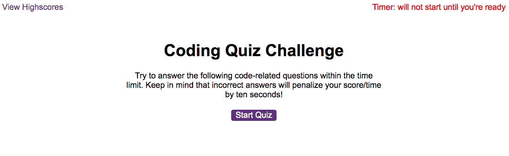
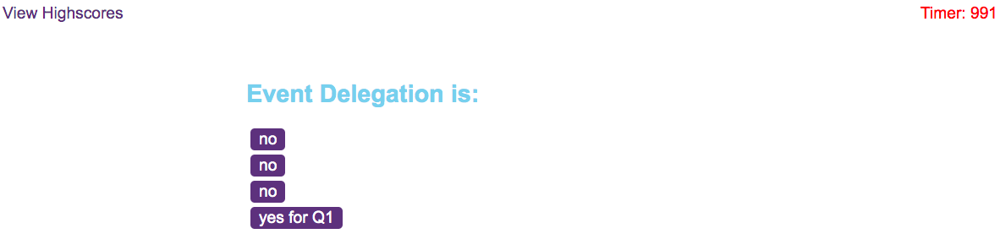
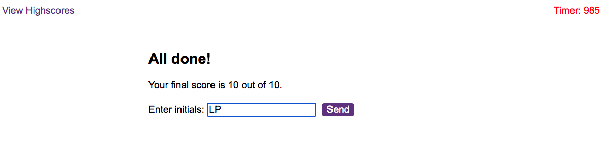
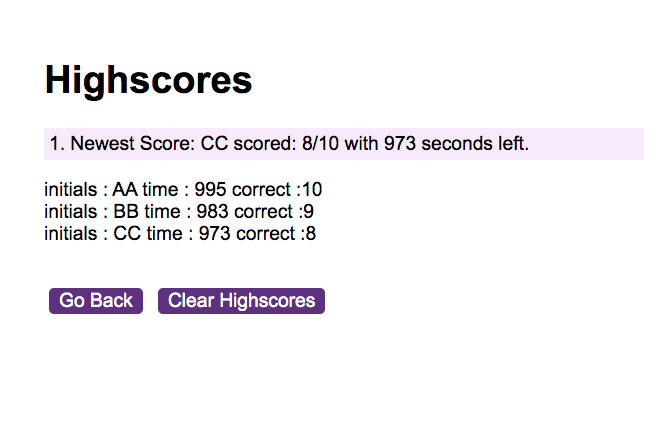

# Coding a multiple choice quiz using `vanilla JS`

## Description
* Below is a boiler-plate html page to start with. I changed some of the wording and font for the timer:

* From here, I built three scripts from scratch. The first one is a `questions.js` file which contains an array of 10 question objects I came up with. For testing purposes, the correct answer is "yes." From there, I wrote `logic.js` with eventListeners to compare and keep track of correct answers as well as a timer penalty if user gets an answer wrong. Lastly, the `scores.js` file is to append all saved data from localStorage onto a separate 'high scores' html page.

As soon as you hit start quiz, here's a multiple choice example that appears. *Notice that the timer begins counting down from 999 seconds. 

Once you finish the last question, your score and time is logged. To save score, enter initials and hit 'send'.

Here's an example of the most recent score highlighted as well as previous scores automatically appended from localStorage.

